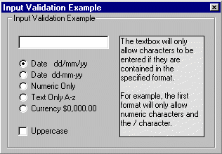



## Input Validation

### Description

Checks the input from the user. Example dd/mm/yy only allows numeric input and the / key. Currency only allows numeric & $ , . Keys.
 
### More Info
 

             |
---                |---
**Submitted On**   |2001-06-11 20:27:54
**By**             |[Matt Trigwell](https://github.com/Planet-Source-Code/PSCIndex/blob/master/ByAuthor/matt-trigwell.md)
**Level**          |Beginner
**User Rating**    |5.0 (15 globes from 3 users)
**Compatibility**  |VB 5\.0, VB 6\.0
**Category**       |[Coding Standards](https://github.com/Planet-Source-Code/PSCIndex/blob/master/ByCategory/coding-standards__1-43.md)
**World**          |[Visual Basic](https://github.com/Planet-Source-Code/PSCIndex/blob/master/ByWorld/visual-basic.md)
**Archive File**   |[Input Vali210476112001\.zip](https://github.com/Planet-Source-Code/matt-trigwell-input-validation__1-24012/archive/master.zip)

